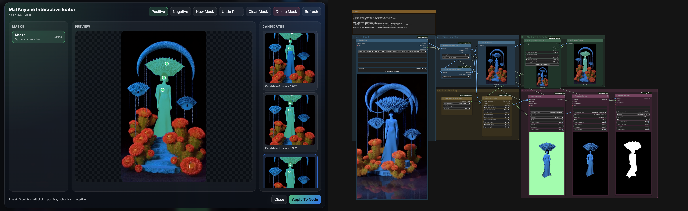

# MatAnyone2 Video Matting for ComfyUI

[](https://github.com/dreamrec/MatAnyone2_ComfyUI/actions/workflows/smoke.yml)
[](https://registry.comfy.org/nodes/matanyone2-video-matting)


Interactive video matting inside ComfyUI with a built-in SAM point editor and MatAnyone2 propagation. Queue once to open the editor on the first frame, queue again to render a clean foreground pass, alpha matte, and preview composite across the full clip.

## Features

- **Two-pass interactive workflow**: fast first queue to open the editor, full second queue to render the matte.
- **Built-in SAM overlay**: positive and negative point editing happens directly in ComfyUI.
- **Multi-target masking**: create and compare multiple mask targets before committing.
- **Pinned vendor snapshots**: the package ships known-good MatAnyone2 and Segment Anything source snapshots in `vendor/`.
- **Bundled starter clip**: the sample workflow ships with a tiny demo video that `install.py` copies into `ComfyUI/input/`.
- **Manager-ready packaging**: `requirements.txt`, `install.py`, workflow example, and registry metadata are all included.

## Installation

### ComfyUI Manager

Search for **MatAnyone2 Video Matting** or **MatAnyone2** in ComfyUI Manager and install the latest stable version.

Registry page: [registry.comfy.org/nodes/matanyone2-video-matting](https://registry.comfy.org/nodes/matanyone2-video-matting)

Manager will:

1. Install Python dependencies from `requirements.txt`
2. Run `install.py` to validate the bundled vendor snapshots and copy `matanyone2-demo-input.mp4` into `ComfyUI/input/`
3. Ask for a ComfyUI restart

### Manual Install

```bash
cd ComfyUI/custom_nodes
git clone https://github.com/dreamrec/MatAnyone2_ComfyUI.git
cd MatAnyone2_ComfyUI
python -m pip install -r requirements.txt
python install.py
```

Restart ComfyUI after installation.

### Companion Node for the Demo Workflow

The bundled workflow uses [ComfyUI-VideoHelperSuite](https://github.com/Kosinkadink/ComfyUI-VideoHelperSuite) for video input and output.

## Models

Models download automatically on first use if they are missing.

| Model | Default location | Auto-download |
|------|------|------|
| [MatAnyone2 checkpoint](https://github.com/pq-yang/MatAnyone2/releases) | `ComfyUI/models/matanyone/` | Yes |
| [SAM ViT-H](https://dl.fbaipublicfiles.com/segment_anything/sam_vit_h_4b8939.pth) | `ComfyUI/models/sams/` | Yes |
| [SAM ViT-L](https://dl.fbaipublicfiles.com/segment_anything/sam_vit_l_0b3195.pth) | `ComfyUI/models/sams/` | Yes |
| [SAM ViT-B](https://dl.fbaipublicfiles.com/segment_anything/sam_vit_b_01ec64.pth) | `ComfyUI/models/sams/` | Yes |

## Included Workflow

`workflows/matanyone2_demo.json` is a ready-to-run example that wires video loading, frame selection, the interactive editor, and final matte export.

It defaults to the bundled `matanyone2-demo-input.mp4` starter clip that `install.py` copies into `ComfyUI/input/`. Swap the `Load Video` node to your own footage whenever you are ready.

```text
LoadVideo -> SliceFrames -> SelectFrame -> Interactive SAM -> Matte -> SaveVideo x3
```

How to use it:

1. Drag `workflows/matanyone2_demo.json` onto the ComfyUI canvas.
2. Queue once on the bundled starter clip, or replace `Load Video` with your own clip first.
3. Queue once to open the editor on the first frame.
4. Left-click for foreground points and right-click for background points.
5. Click `Apply` in the editor.
6. Queue again to render the full matte outputs.

## Gallery

Real workflow + editor capture from the live node pack:



## Node Overview

Nodes are grouped under `MatAnyone2` and `MatAnyone2/SAM` in the Add Node menu.

| Node | What it does |
|------|------|
| **MatAnyone2 Model Loader** | Loads MatAnyone or MatAnyone2 checkpoints |
| **MatAnyone2 SAM Loader** | Loads a SAM checkpoint for programmatic refinement |
| **MatAnyone2 Slice Frames** | Splits a video image batch into frame data |
| **MatAnyone2 Select Frame** | Pulls a single frame for interactive setup |
| **MatAnyone2 Prompt Start** | Creates an empty point prompt structure |
| **MatAnyone2 Prompt From Text** | Builds prompts from text coordinates |
| **MatAnyone2 Add Point** | Adds foreground or background points in-node |
| **MatAnyone2 SAM Refine** | Runs SAM refinement with explicit prompts |
| **MatAnyone2 Merge Masks** | Merges up to four masks into one |
| **MatAnyone2 Preview Masks** | Draws mask overlays on the source frame |
| **MatAnyone2 Interactive SAM** | Launches the built-in multi-target editor |
| **MatAnyone2 Matte** | Propagates the first-frame mask through the whole clip |

## Requirements

- ComfyUI with Python 3.10+
- PyTorch with CUDA, MPS, or CPU support
- 8 GB VRAM minimum, 12+ GB recommended for longer or higher-resolution clips
- Internet access on first run if you want automatic model downloads

## Troubleshooting

- If the editor does not open, queue the workflow once so the first-frame preview exists.
- If the demo workflow shows missing video nodes, install VideoHelperSuite first.
- If `Load Video` is blank or points at `/input/`, rerun `install.py` so the bundled demo clip is copied into `ComfyUI/input/`, or choose your own video in the VHS node before queueing.
- If ComfyUI Manager shows a security warning for network access, you are likely on an older registry build from before the vendor sources were bundled directly in the package.
- If VRAM is tight, use a smaller SAM variant and lower `max_internal_size`.
- If you already keep checkpoints elsewhere, pass an explicit `checkpoint_path` to the loader nodes.

## Credits

- [MatAnyone2](https://github.com/pq-yang/MatAnyone2) for the video matting model
- [Segment Anything](https://github.com/facebookresearch/segment-anything) for interactive segmentation
- [ComfyUI](https://github.com/comfyanonymous/ComfyUI) for the host runtime

## License

This repository is licensed under [GPL-3.0](LICENSE).

Vendored upstream dependencies keep their own licenses:

- MatAnyone2: [Apache-2.0](https://github.com/pq-yang/MatAnyone2/blob/main/LICENSE)
- Segment Anything: [Apache-2.0](https://github.com/facebookresearch/segment-anything/blob/main/LICENSE)

```text
┌─────────────────────────────────────────────────────────────────────┐
│ dreamrec // MatAnyone2 // queue once, edit, queue again            │
└─────────────────────────────────────────────────────────────────────┘
```
